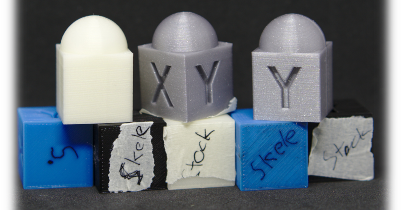

## Upgrading the Prusa mk3 and its influence on wall quality

:arrow_down: **Images below!** :arrow_down:

I upgraded my Prusa mk3 R2 build with different axis and extruder. I printed different models before and after the upgrade to see how it affects the print quality. While I did also print all-in-one test, I wanted to focus on wall quality.

### Limitions

There are many things you can tweak on a 3d printer. Both hardware and software. I tried to stick with stock slicer settings as much as possible. You will also see some minor ghosting on the x axis on my stock prints, just ignore them. They could have been removed with belt tension improvements. But that is a pita on stock mk3.

### Models

* [602 cube](https://www.thingiverse.com/thing:3296697/files)
* Single perimeter 40x40 cube 
* [3d test v3](https://www.thingiverse.com/thing:1363023)
* Overhang and bridge test
* [Benchy](http://www.3dbenchy.com/)

All stl files are [on this github repo](https://github.com/lord-carlos/mk3-upgrade/tree/master/assets/models).

### Upgrades

* [LDO blower fan](https://zaribo.com/electronics/88-radial-cooling-fan-5v-mk3.html) (slight more powerfull)
* [LDO Pancake Extruder Motor](https://zaribo.com/home/126-zaribo-pancake-motor-by-ldo.html) - runs cooler, even with stock current.
* [Sunon hotend fan](https://zaribo.com/home/127-sunon-5v-40mm-x-40mm-fan.html) - vastly better cooling.
* [Taurus Y](https://www.thingiverse.com/thing:3269389)
* [Taurus X](https://www.thingiverse.com/thing:3308841)
* [Taurus Z](https://www.thingiverse.com/thing:3321711)
* [Skelestruder](https://www.thingiverse.com/thing:2845416)

Both stock and skele had [nozzle X](https://e3d-online.com/nozzlex-v6) and a nozzle sock. Stock also had [a new nozzle fan thingy](https://www.thingiverse.com/thing:3249344) from RH_Dreambox.

### Slicer settings and firmware

I used slic3r PE 1.42.0-beta1 with stock `0.20mm SPEED MK3` profiles. Any per model changes are documented below. For the skele prints I edited the k value from 30 down to 20 and retraction from 0.8 to 0.6.

- [602 cube](https://www.thingiverse.com/thing:3296697/files): 
  - seam position: rear
- [3d test v3](https://www.thingiverse.com/thing:1363023):
  - Detect thin walls
- 40x40 cube
  - perimeters:	1
  - Solid layers top: 	0
  - Solid layers Bottom: 	1
  - Infill: 	0
- Ghosting / Speed test:
  - Speed: 120 mm/s (All of them)
  - Acceleration control: 1250 mm/s^2
  - Slow down if layer print time is below: 5
 - `fan_test_-_Part_2b`
  - Brim width: 5mm

Firmware was 3.4.2 before and after.

### Filament

To eliminate filament as a variable, I used Prusament for some before/after prints. I could not see any difference in Prusament vs cheap local, with focus on external perimeter qualty.

 * Prusament PLA Vanilla White, 210C (or 215C)
 * Prusa Silver (Not Prusament, the one I got with my mk3), 200C
 * Pirate Black - 3DE Premium PLA, 200C
 * Some blue 3DE Premium PLA, 200C

### Results

- 602 cube: Both in real life and on images I can't see any differences. Maybe some slight difference on the top? [Side by side in good light](https://lord-carlos.github.io/mk3-upgrade/assets/images/20190525T190444.jpg)
  - [Blue 602 cube](https://cdn.knightlab.com/libs/juxtapose/latest/embed/index.html?uid=9317ddc4-7fa7-11e9-8804-0edaf8f81e27) - ([slightly lower light angle](https://cdn.knightlab.com/libs/juxtapose/latest/embed/index.html?uid=4b2ed206-7fac-11e9-8804-0edaf8f81e27))
  - [White 602 cube](https://cdn.knightlab.com/libs/juxtapose/latest/embed/index.html?uid=e960ff20-7fb2-11e9-8804-0edaf8f81e27) - ([slightly lower light angle](https://cdn.knightlab.com/libs/juxtapose/latest/embed/index.html?uid=9c29fc98-7fb2-11e9-8804-0edaf8f81e27))
  - [Black 602 cube](https://cdn.knightlab.com/libs/juxtapose/latest/embed/index.html?uid=1c4ff6ac-7fb3-11e9-8804-0edaf8f81e27) - ([slightly lower light angle](https://cdn.knightlab.com/libs/juxtapose/latest/embed/index.html?uid=39a46332-7fb3-11e9-8804-0edaf8f81e27))
  - [Silver 602 cube](https://cdn.knightlab.com/libs/juxtapose/latest/embed/index.html?uid=867e88ae-7fb3-11e9-8804-0edaf8f81e27) - ([slightly lower light angle](https://cdn.knightlab.com/libs/juxtapose/latest/embed/index.html?uid=61f57646-7fb3-11e9-8804-0edaf8f81e27))
- Single wall 40x40 cube: On skele (right) you can see some slight pattern, geoing on a 30 degree angle slighty upwards. But the stock also has some kind of pattern, harder to see on the images. Going steep down. Otherwise I can't tell a difference.
  - [Blue wall](https://cdn.knightlab.com/libs/juxtapose/latest/embed/index.html?uid=27e47d2c-7fb7-11e9-8804-0edaf8f81e27)
  - [White wall](https://cdn.knightlab.com/libs/juxtapose/latest/embed/index.html?uid=3840c04a-7fb7-11e9-8804-0edaf8f81e27)
  - [Black wall](https://cdn.knightlab.com/libs/juxtapose/latest/embed/index.html?uid=42c34b5a-7fb7-11e9-8804-0edaf8f81e27)
  - [Silver wall](https://cdn.knightlab.com/libs/juxtapose/latest/embed/index.html?uid=541395b8-7fb7-11e9-8804-0edaf8f81e27)
- Overhang and bridge test: Skele with LDO blower is slighty better at overhangs, but at such a steep angle you want to avoid models like that anyway. I see no difference at bridging.
  - [Comperison slider](https://cdn.knightlab.com/libs/juxtapose/latest/embed/index.html?uid=5927cede-7fd5-11e9-8804-0edaf8f81e27)
  - [Full image](https://lord-carlos.github.io/mk3-upgrade/assets/images/overhang.jpg) (!large filesize!)
- Ghosting / Speed test: I printed this, but decided it's not a good test. Had some minor ghosting on both skele and stock. But that should be fixed with messing with the belts.
- 3d test v3: I don't see a difference
  - [Image](https://lord-carlos.github.io/mk3-upgrade/assets/images/3d%20test%20v3.jpg) (!large filesize!)
- Benchy: [both look fine.](https://lord-carlos.github.io/mk3-upgrade/assets/images/benchy_zoom.jpg)

### Conclusion

Shit man, IDK. Skele++ [looks cool](https://streamable.com/0xq1e) and thanks to Taurus I can change my belt tension without any tools. Many people reportet that even just sunon fan on stock makes a huge difference to them. I printed with low ambient, ~16C, maybe in hotter climate you need more fan power?
I think we need more people to try and document mk3 upgrades. 

### Thanks

Thanks to all the peeps fromt he [602 Wasteland discord](https://discord.gg/FCncyZn). Especially [Greg](https://www.thingiverse.com/pekcitron/about), the bear, and [Jltx](https://www.thingiverse.com/jltx/about), first to his name.
